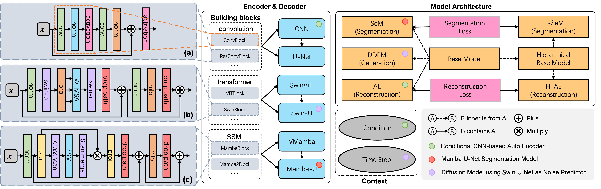
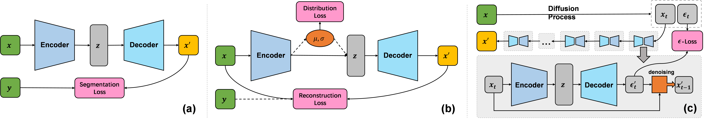
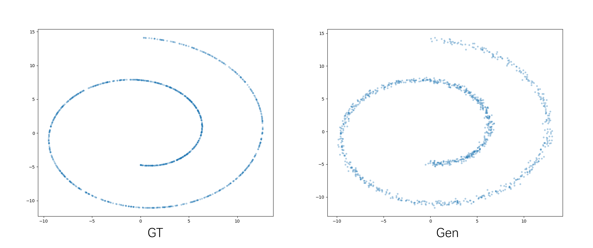
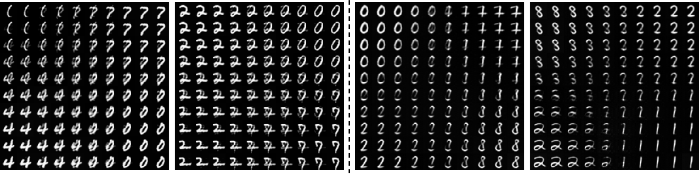
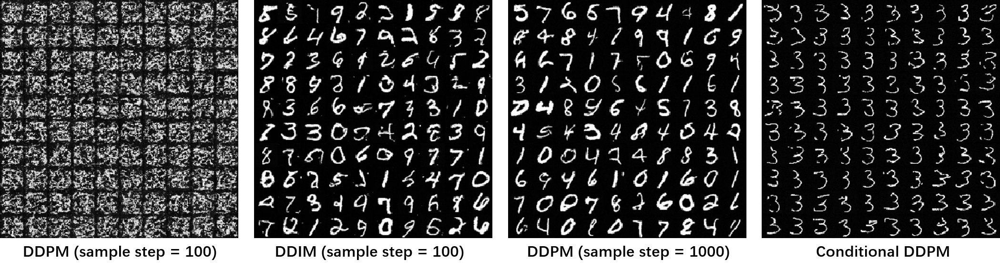
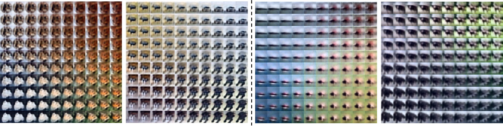
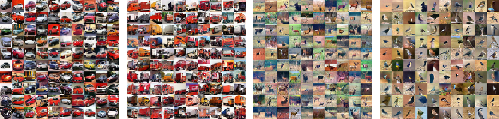

# Flemme: A **FLE**xible and **M**odular Learning Platform for **ME**dical Images
## Overview
Flemme is a flexible and modular learning platform for medical images. In Flemme, we separate encoders from the model architectures, enabling fast model construction via different combinations for medical image segmentation, reconstruction and generation. In addition, a general hierarchical architecture with a pyramid loss is proposed for vertical feature refinement and integration.

We are also working on Flemme to support point cloud modeling.



### Supported architectures

### Hierarchical architecture with a pyramid Loss (H-SeM + UNet)
<p align="center">

</p>

## Get started with Flemme
### Requirement list
#### Basic:
```
torch torchvision simpleitk nibabel matplotlib scikit-image scikit-learn tensorboard
```
#### For vision transformer:
```
einops
```
#### For vision mamba: 
```
mamba-ssm (CUDA version >= 11.6)
```
#### For point cloud:
```
POT plyfile
```
You can modify `flemme/config.py` to disable some components of Flemme so that you don't need to install the corresponding required packages.

### Setup

Git clone from git@github.com:wlsdzyzl/flemme.git

Run following commands in terminal to setup Flemme to your environment:
```
cd flemme
python setup.py install
```
### Usage
Creating a deep learning model with Flemme is quite straightforward; you don't need to write any code. All things can be down through a `yaml` config file. An example of constructing a segmentation model with UNet encoder uisng ResConvBlock looks like:
```yaml
model:
  ### architecture
  name: SeM
  ### encoder
  encoder:
    name: UNet
    image_size: [320, 256]
    in_channel: 3
    out_channel: 1
    patch_channel: 32
    patch_size: 2
    down_channels: [64, 128, 256]
    middle_channels: [512, 512]
    building_block: res_conv
    normalization: batch
  ### loss function
  segmentation_losses: 
    - name: Dice
    - name: BCEL

```
You may also need to specify the data-loader, optimizer, checkpoint path and other hyper-parameters. A full configuration refers to `resources/img/biomed_2d/cvccdb/train_unet_sem.yaml`. To train the model, run command:
```
train_flemme --config path/to/train_config.yaml
```
For visualization of the training process:
```
tensorboard --logdir path/to/ckp/
```
For testing:
```
test_flemme --config path/to/test_config.yaml
```
**Supported encoders**: 
- [CNN, UNet, ViT, ViTU, Swin, SwinU, VMamba, VMambaU] for 2D/3D image 
- [PointWise, PointNet, DGCNN] for point cloud.

*A encoder named as XXU indicates it's a U-shaped encoder.*

*UNet is an alias of CNNU.*

**Supported Architectures**: 
- [SeM, HSeM] for segmentation, 
- [AE, HAE, SDM] for reconstruction, 
- [VAE, DDPM, DDIM, LDM] for generation. 

*DDIM refers to denoising diffusion implicit model, which is a fast sample strategy.*

*SDM refers to supervised diffusion model (use input as a input condition of ddpm).*

*LDM refers to latent diffusion model, constructed with a auto-encoder/ vae and ddpm.*

A detailed instruction of supported encoders, context embeddings, model architectures and training process can refer to [documentation of flemme](https://flemme-docs.readthedocs.io/en/latest/).
## Results

For segmentation, we evaluate our methods on six public datasets: **CVC-ClinicDB, Echonet, ISIC, TN3K, BraTS21 (3D), ImageCAS (3D)**.

For reconstruction, we evaluate our methods on **FastMRI**.

Configuration files are in `resources/img/biomed_2d` and `resources/img/biomed_3d`.
### Segmentation results

### Reconstruction & Generation results

## Play with Flemme
#### Toy Example for Diffusion model
Configuration file: `resources/toy_ddpm.yaml`
```
train_flemme --config resources/toy_ddpm.yaml
```

#### MINST 
Configuration files are in  `resources/img/mnist`
**AutoEncoder** & **Variational AutoEncoder**



**Denoising Diffusion Probabilistic Model**

#### CIFA10 
Configuration files are in `resources/img/cifar10`
**AutoEncoder** & **Variational AutoEncoder**



**Denoising Diffusion Probabilistic Model (conditional)**

## BibTeX
Coming soon ...

## Acknowledgement
Thanks to [mamba](https://github.com/state-spaces/mamba), [swin-transformer](https://github.com/microsoft/Swin-Transformer), [diffusion model](https://github.com/lucidrains/denoising-diffusion-pytorch) for their wonderful works.
